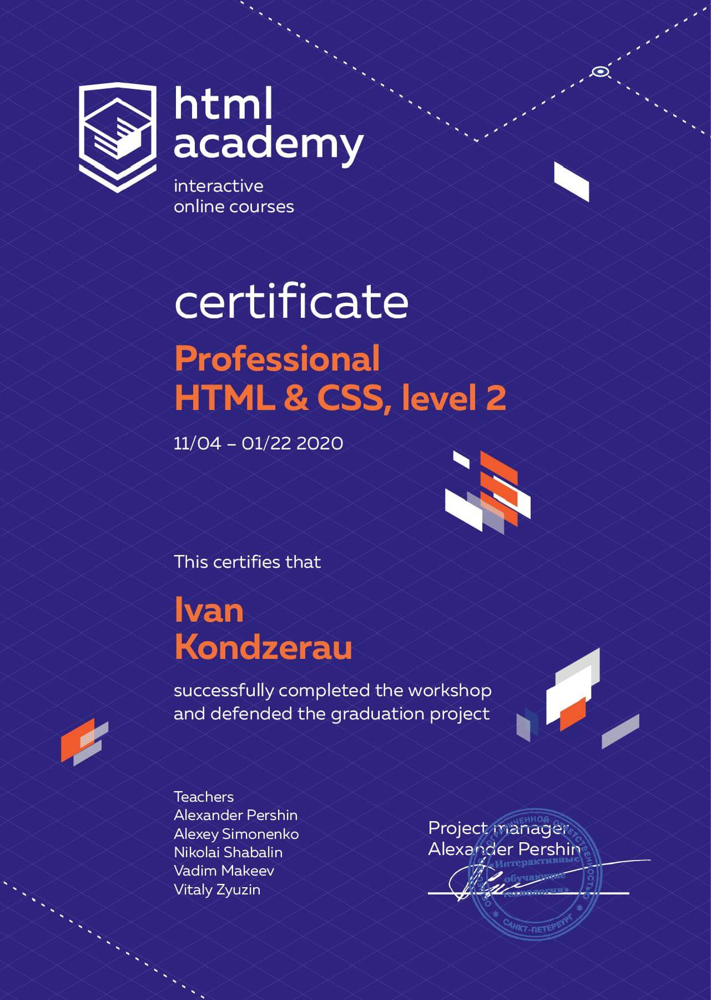

# Ivan Kondzerau


**Contact info:**
* +375296661325
* [GitHub](https://github.com/kondzerau-ivan)
* [LinkedIn](https://www.linkedin.com/in/ivan-kondzerau/)
* konderev.ivan@gmail.com


**I'm a mature person with a wide range of work experiences who is currently studying Web-development. I'm interested in such technologys like node and react.**


| Skills | Details | Level |
|--------|---------|-------|
| HTML | Often used tags, semantic elements | Practice using and good understanding |
| CSS | Selectors, pseudo-elements and pseudo-classes, inhetitance and cascading, Bem-methodology | Practice using and good understanding |
| JavaScript | Basic syntax: conditions, loops, arrays, functions and objects | I familiar with OOP and functional programming on basic theoretical level - [codewars.com](https://www.codewars.com/users/konderev.ivan) |
| SQL | Syntax | Basic SQL querys |
| MongoDB | Compas, document model and basic schema design, query language | I completed the course [M001: MongoDB Basics](http://university.mongodb.com/course_completion/2898d33a-1d1b-4064-b842-280c87b0d025) on MongoDB University |
| Git | Basic level, such as: clone, add, commit, pull, push, merge and use SSH-keys | Working with git on git-bash (Windows 10) or terminal (Ubuntu) |
| Web | DOM and http-protocol | Good understanding |
| OS | Windows (XP, 7, 10), Ubuntu | Advanced user |
| Software development models and methodologies | Waterfall, Agile (Scrum, Kanban); Test-Driven-Development, Behavior-Driven-Development | Understanding main principles |


## Code examples

### [Find the unique number](https://www.codewars.com/kata/585d7d5adb20cf33cb000235)

There is an array with some numbers. All numbers are equal except for one. Try to find it!
```javascript
findUniq([ 1, 1, 1, 2, 1, 1 ]) === 2
findUniq([ 0, 0, 0.55, 0, 0 ]) === 0.55
```
It’s guaranteed that array contains more than 3 numbers.

The tests contain some very huge arrays, so think about performance.

#### Solution:

```javascript
function findUniq(arr) {
  for (var i = 1; i <= arr.length; i++){
    if (arr[i - 1] != arr[i] && arr[i - 1] === arr[i + 1]){
      return arr[i];
    }
    if (arr[i - 1] != arr[i] && arr[i - 1] != arr[i + 1]){
      return arr[i - 1];
    }
    if (arr[i - 1] === arr [i] && arr[i - 1] != arr[i + 1]){
      return arr[i + 1];
    }
  } 
}
```


## Education

* [Mogilev State A. Kuleshov University](https://www.msu.by/en/)
  * Physics and informatics - completed 4 courses out of 5;
* [HTML Academy](https://htmlacademy.ru/profile/id1033347)
  * Frontend developer (html & css - level 1, html & css - level 2), javascript - level 1 - currently studying;
* [RS School](https://rs.school/)
  * Javascript / Frontend - currently studing;

### Certificates




## English

**I learned English at school and university. Think, I have A2 (pre-intermediate) level. I can read docs and watch tutorials on youtube and udemy in original. I can speak with a short sentences with a wide range of themes. Time to time I like to watch some TV shows in original, like Netflix, Amazon, HBO etc.**